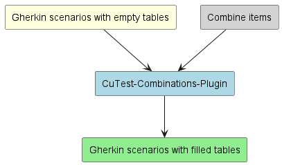

:doctype: book
:toc:
:toclevels: 1
:source-highlighter: rouge
image::doc/images/Gematik_Logo_Flag.png[logo,width=200,height=37,role=right]
= Cucumber-Test-Combinations-Maven-Plugin

== About The Project
The Cucumber-Test-Combinations-Maven-Plugin or CuTest-Combinations-Plugin fills empty examples tables in cucumber feature files with combinations of predefined values. The generated combinations can be configured by various filters.

=== Release Notes
See link:ReleaseNotes.md[ReleaseNotes] for all information regarding the (newest) releases.

== Usage
Add the following to you `pom.xml` and configure the plugin as you need:

[source,xml]
----
<plugin>
include::pom.xml[tag=maven-coordinates]
</plugin>
----

To use the plugin you have to do two things:

1. provide "combine items" (the values which will be filled in the empty tables) as JSON file with this structure:
+
[source,json]
----
[ <1>
  {
    "value": "myValue", <2>
    "tags": ["myTag"], <3>
    "properties": { <4>
        "myProp": "A"
    }
  }
]
----
<1> The file contains a list of items. You can declare as many items as you want.
<2> Each item needs a value. This value will be later inserted in the tables.
<3> Items can have tags. Tags are just Strings associated with an item and can be used by filters
to manipulate the combination generation.
<4> Items can have properties. Properties are key-value pairs associated with an item and can be used by filters
to manipulate the combination generation.

2. configure the empty tables in your feature files with  tags that represent your constraints
+
[source,gherkin]
----
Feature:  example feature
 Scenario Outline:
  When you do something with <column_1> and <column_2>
  Then something happens

    @Filter(column_1.hasTag("myTag")) <1>
    @Filter(column_1.properties["myProp"].equals(column_2.properties["myProp"])) <2>
    Examples:
      | column_1 | column_2 | <3>
----
<1> The plugin will only use values with the tag `myTag` to fill the column_1.
<2> The plugin will only generate combinations for this table where the values in column_1 and column_2 have the same property `myProp`
<3> An empty examples table with header names. You can access the table columns in the filter tags over their header names.

For in-depth documentation of the configuration, please refer to link:doc/userguide/GettingStarted.adoc[GettingStarted].

== Contributing
If you want to contribute, please check our link:CONTRIBUTING.md[CONTRIBUTING.md].

== License

Copyright 2023 gematik GmbH

Licensed under the *Apache License, Version 2.0* (the "License"); you may not use this file except in compliance with the License.

Unless required by applicable law or agreed to in writing, software distributed under the License is distributed on an "AS IS" BASIS, WITHOUT WARRANTIES OR CONDITIONS OF ANY KIND, either express or implied. See the link:./LICENSE[LICENSE] for the specif ic language governing permissions and limitations under the License.
