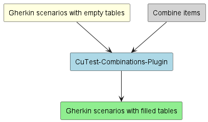
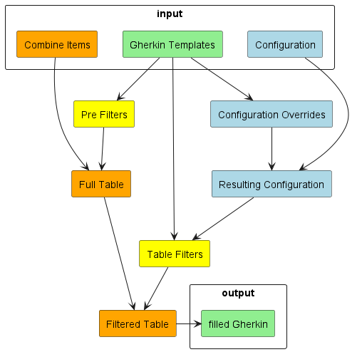

== Overview

// TODO rewrite

=== Who will find it useful?
This tool is useful for all who want to parameterize their feature files with an external input.
The plugin will get this external input and will add it to feature files as a table of Examples.
If there are more than one column it will combine all values against another.

=== What does it do?

==== maven goal "prepare-features"

It takes all templates with defined ending from one given path and copies them to a destination path.
After this it will create all possible combinations of the input values and will add them as rows to the examples table.
The given tags for each scenario will decide which items will be combined in its table.

==== maven goal "prepare-items"

This goal allows to modify the tags and properties of the combination items before they are evaluated in the `prepare-features` goal. An information json is loaded for each combine item and can be evaluated with Jexl expressions afterwards to modify the tags and properties.